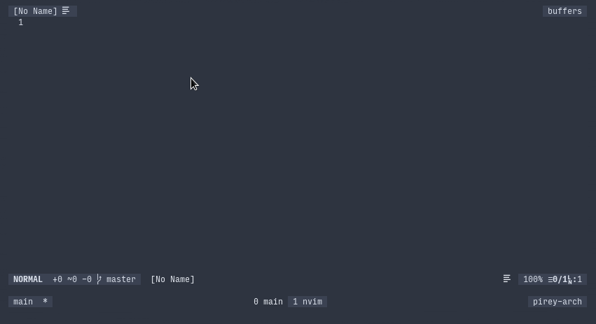

# underscored.vim

Press `<C-G><Space>` in insert mode to swap space to underscore.

## Installation

Install using any vim plugin manager, or with vim-plug:

    Plug 'pirey/underscored.vim'

Then run `:PlugInstall`

## License

Copyright (c) Pirey.  Distributed under the same terms as Vim itself.
See `:help license`.
